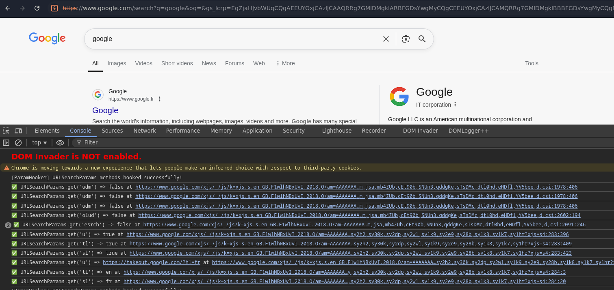
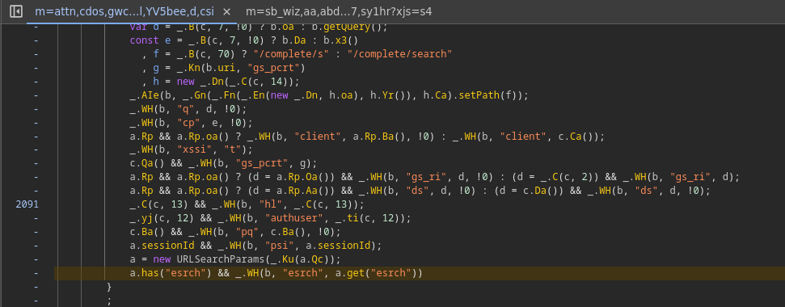

# Param Hooker

## Description

This browser extension is designed to hook into the `URLSearchParams` API in order to automatically detect and log all GET parameters accessed by the frontend JavaScript. This is especially useful in large-scale modern web applications built with frameworks like **Next.js**, **React**, or **Angular**, where:

- The codebase is often **massive** and **heavily minified**.
- Manual analysis of the JavaScript code to find which query parameters are used can be extremely **time-consuming** and **inefficient**.
- Parameters may be consumed dynamically, making them hard to trace with static analysis tools.

By intercepting calls to `URLSearchParams.get()`, `.has()`, and other methods, this extension helps frontend developers, security researchers, and bug bounty hunters quickly identify which query parameters are actually being read by the application — **in real time**, directly in the browser console.

No need to reverse-engineer bundles or scroll endlessly through minified code — just load the extension, refresh the page, and watch the parameters appear.

This is just a Proof of Work for `URLSearchParams` and this can also be useful for `postMessage` or `WebSockets` etc.

## Installation

### Load as Unpacked Extension

1. Clone or download this repository.
2. Open your browser and navigate to `chrome://extensions/`.
3. Enable **Developer mode** (top-right toggle).
4. Click on **Load unpacked**.
5. Select the folder where the extension's source code is located.
6. Visit any page with query parameters and open the **developer console** to see the logs.

## Example Output

Once the extension is loaded, go to your chosen website and open devtools.

You will se the output of ParamHooker like this:

All the parameters that the frontend is parsing are displayed.

There is also a reference to the source and line of the function : 

This approach is particularly useful for identifying potential XSS vectors, open redirects, or even hidden debug parameters — all of which can be easily overlooked in complex frontend applications without dynamic inspection.